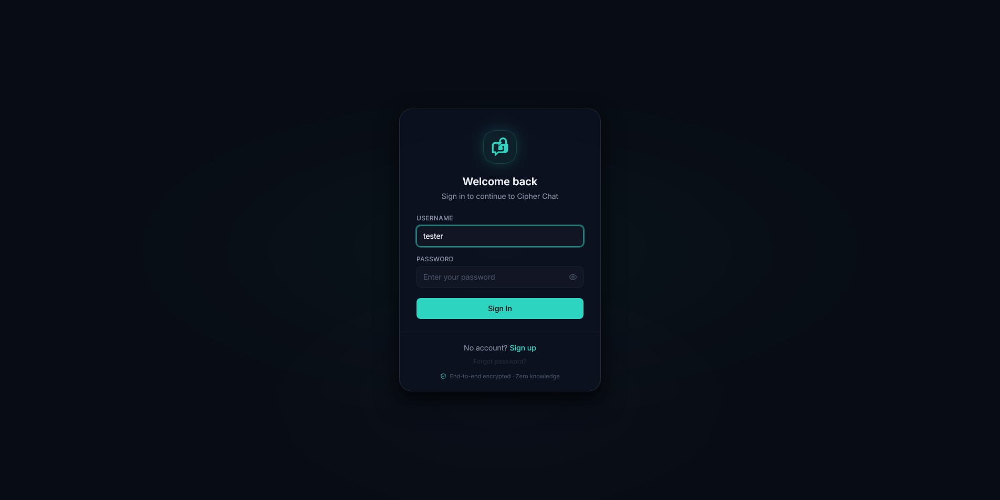
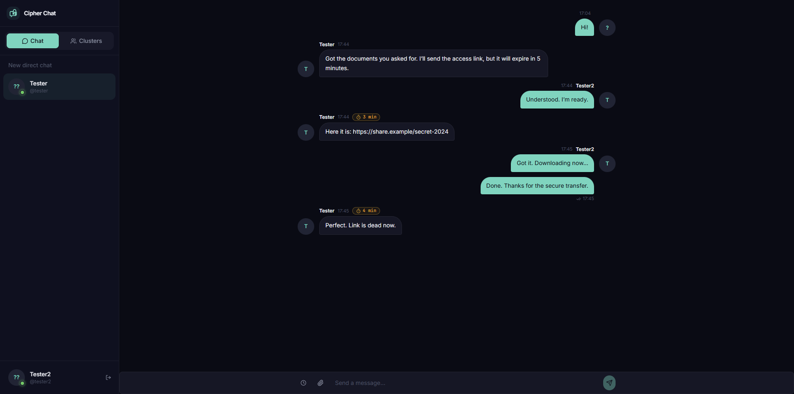
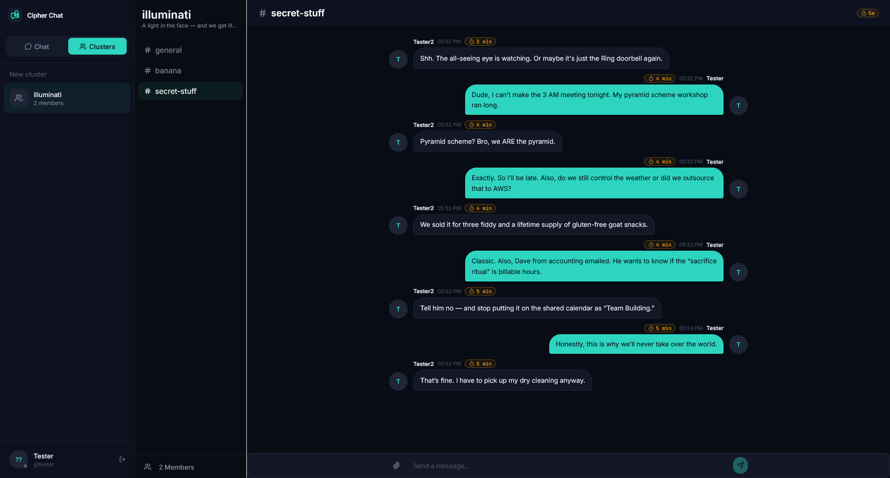
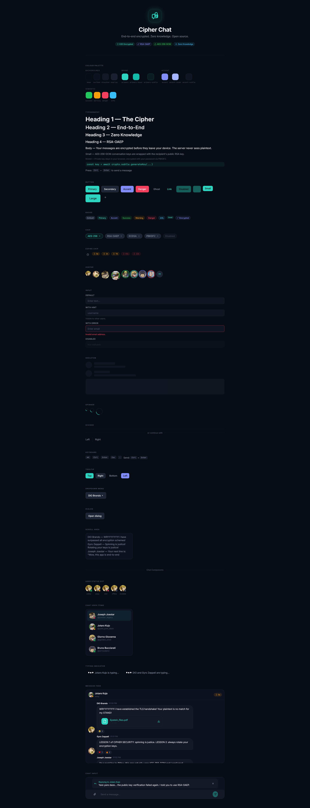

# Cipher Chat

> Privacy-first, end-to-end encrypted real-time chat — open source, self-hosted, Discord-like.


---

## What is this?

Cipher Chat is a privacy-oriented chat and collaboration space — think Discord, but open source and self-hosted. Messages are end-to-end encrypted: the server never sees plaintext. All message state lives in memory only and vanishes on logout.

**Status:** early development (embryo stage).

---

## Features

- **End-to-end encryption** — RSA-OAEP key pairs per user, AES-256-GCM per conversation
- **Zero server-side message reading** — server stores encrypted blobs only
- **Key rotation** — removing a member generates a new key version
- **Disappearing messages** — client-side self-destruct timers (1 min → 7 days)
- **Clusters with topics** — group spaces with multiple topic channels
- **1-to-1 private chats** — direct encrypted conversations
- **Real-time** — Socket.io WebSocket layer; typing indicators, presence status
- **File sharing** — encrypted file uploads (server-side AES-256-GCM)
- **Block system** — blocked users cannot message or see online status
- **Account recovery** — BIP-39 12-word mnemonic

---

## Screenshots

| Login | Chat |
|-------|------|
|  |  |

| Cluster | Design System |
|---------|---------------|
|  |  |

---

## Architecture

```
┌──────────────────────────────────────┐
│  web/   (React 19 SPA)               │
│  Vite · TypeScript · Tailwind CSS    │
│  Zustand · TanStack Query            │
└────────────┬─────────────────────────┘
             │  REST + WebSocket
┌────────────▼─────────────────────────┐
│  server/   (Node.js API)             │
│  Express · Socket.io · Mongoose      │
│  JWT · bcrypt · AES-256-GCM          │
└────────────┬─────────────────────────┘
             │
┌────────────▼─────────────────────────┐
│  MongoDB                             │
└──────────────────────────────────────┘
```

---

## Monorepo layout

| Directory | Description |
|-----------|-------------|
| [`web/`](web/) | React frontend (SPA) |
| [`server/`](server/) | Node.js REST + WebSocket backend |

See [`web/README.md`](web/README.md) and [`server/README.md`](server/README.md) for full per-app documentation.

---

## Quickstart

### Prerequisites

- Node.js 18+
- MongoDB 6+

### 1. Clone and install

```bash
git clone https://github.com/SalvM/cipher-chat.git
cd cipher-chat
npm install
```

`npm install` at the root installs dependencies for both `web/` and `server/` via npm workspaces.

### 2. Configure environment

```bash
# Frontend
cp web/.env.example web/.env
# Set VITE_BACKEND_URL=http://localhost:8001

# Backend
cp server/.example.env server/.env.dev
# Set MONGO_URL, DB_NAME, JWT_SECRET, ENCRYPTION_KEY, CORS_ORIGINS
```

### 3. Start MongoDB

```bash
mongod
# or use MongoDB Atlas — set MONGO_URL accordingly
```

### 4. Run

Open two terminals:

```bash
# Terminal 1 — backend (Windows)
npm run dev:server

# Terminal 2 — frontend
npm run dev:web
```

Frontend: [http://localhost:5173](http://localhost:5173)  
Backend: [http://localhost:8001](http://localhost:8001)

---

## Root scripts

| Script | What it does |
|--------|--------------|
| `npm run dev:web` | Start frontend dev server |
| `npm run dev:server` | Start backend (Windows, loads `.env.dev`) |
| `npm run build:web` | Production build for frontend |
| `npm run lint:web` | Lint frontend |
| `npm install` | Install all workspace dependencies |

---

## License

MIT — see [LICENSE](server/LICENSE).

## Author

**Salvatore** — [@SalvM](https://github.com/SalvM) · salvatore.manna@protonmail.com
